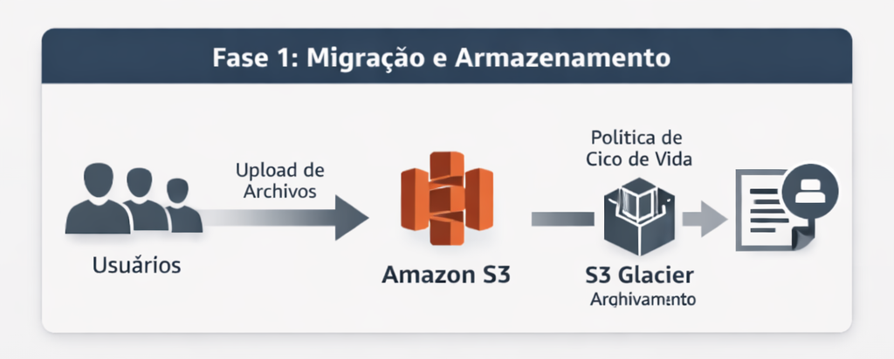
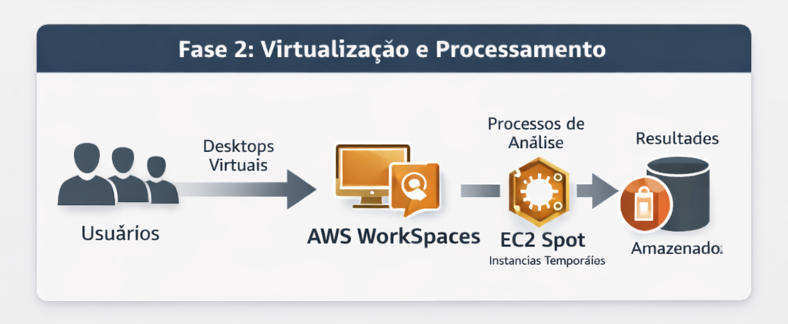
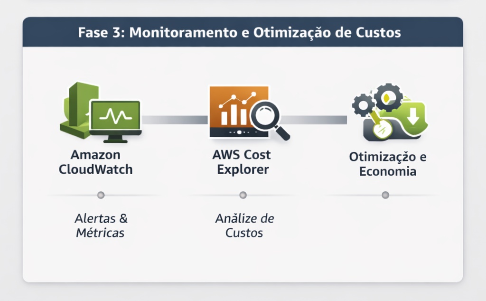

# Relatório de Implementação de Serviços AWS  
Data: **18/05/2026** 
Empresa: **ABC Indústrias de Fármacos** 
Responsável: **Marcelo Santos**

---

## Introdução

A ABC Indústrias de Fármacos utiliza atualmente apenas soluções de produtividade e armazenamento baseadas no Microsoft Office 365 e OneDrive. Embora essas ferramentas atendam às necessidades básicas de criação e compartilhamento de documentos, elas não oferecem mecanismos avançados de otimização de custos, automação, escalabilidade ou governança de dados.

Com o objetivo de reduzir custos imediatos e preparar a empresa para uma infraestrutura mais eficiente, foi proposto o início da adoção de serviços da Amazon Web Services (AWS). A AWS oferece soluções de armazenamento, backup, automação e monitoramento que permitem reduzir despesas operacionais, melhorar a segurança e aumentar a eficiência no uso de recursos digitais.

---

## Descrição do Projeto

O projeto foi dividido em **três etapas**, cada uma com foco em redução de custos e otimização de processos.

---

### Etapa 1:
- **Ferramenta(s):** Amazon S3 + S3 Glacier 
- **Foco da ferramenta(s):** Armazenamento escalável e arquivamento de baixo custo  
- **Descrição de caso de uso:**  
  Migração gradual dos arquivos armazenados no OneDrive para o **Amazon S3**, utilizando políticas de ciclo de vida para mover automaticamente documentos antigos para **S3 Glacier**, que possui custo extremamente reduzido para dados pouco acessados.  
- **Economia estimada:**  
  - Redução de **30% a 45%** nos custos de armazenamento.  
  - Custos de arquivamento até **80% menores** ao mover documentos antigos para Glacier.

---

### Etapa 2:
- **Ferramenta(s):** AWS WorkSpaces + EC2 Spot Instances
- **Foco da ferramenta(s):** Virtualização de desktops e redução de custos computacionais  
- **Descrição de caso de uso:**  
  Substituição gradual de máquinas locais de alto custo por **AWS WorkSpaces**, permitindo desktops virtuais sob demanda.  
  Para processos internos de análise ou automações, uso de **EC2 Spot Instances**, que oferecem capacidade computacional com desconto significativo.  
- **Economia estimada:**  
  - Redução de **25% a 40%** em custos de hardware e manutenção.  
  - Redução de **60% a 70%** nos custos de processamento com instâncias Spot.

---

### Etapa 3:
**Ferramenta(s):** AWS CloudWatch + AWS Cost Explorer
- **Foco da ferramenta(s):** Monitoramento, governança e otimização contínua de custos  
- **Descrição de caso de uso:**  
  Implementação do **CloudWatch** para monitorar o uso dos recursos AWS e gerar alertas automáticos de consumo anormal.  
  Utilização do **Cost Explorer** para identificar desperdícios, prever gastos e ajustar políticas de uso.  
- **Economia estimada:**  
  - Redução adicional de **10% a 15%** ao eliminar recursos subutilizados.  
  - Prevenção de picos inesperados de custo, garantindo previsibilidade financeira.

---

## Conclusão

A implementação das ferramentas AWS propostas permitirá à ABC Indústrias de Fármacos reduzir custos imediatos e estabelecer uma base tecnológica mais eficiente e escalável.  
Somando as três etapas, a empresa pode alcançar uma economia total estimada entre **40% e 60%** nos custos relacionados à infraestrutura digital, além de ganhos indiretos em segurança, automação e produtividade.

---

## Anexos

### Links Oficiais das Ferramentas AWS
Armazenamento
* Amazon S3: https://aws.amazon.com/pt/s3/
* S3 Glacier: https://aws.amazon.com/pt/s3/storage-classes/glacier/ 

Computação e Virtualização
* AWS WorkSpaces: https://aws.amazon.com/pt/workspaces/
* EC2 Spot Instances: https://aws.amazon.com/pt/ec2/spot/ 

Monitoramento e Custos
* Amazon CloudWatch: https://aws.amazon.com/pt/cloudwatch/
* AWS Cost Explorer: https://aws.amazon.com/pt/aws-cost-management/aws-cost-explorer/ 